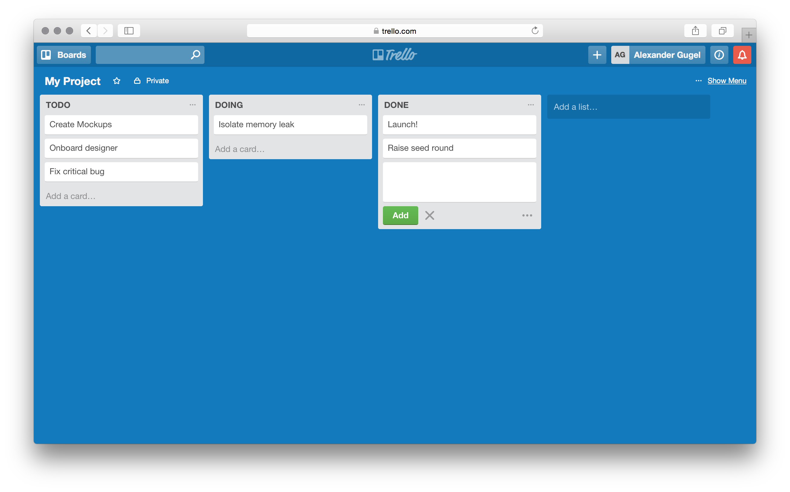

# React Unidirectional Data

## Objectives

1. Explain what we mean by "unidirectional data"
2. Explain how React makes use of unidirectional data in components (think
   `setState()`)
3. Describe how to take advantage of unidirectional data flow in an application

## Overview

In this lesson we're going to learn about a concept called "unidirectional"
data-flow. Web Applications are primarily centered around rendering application
state and data. It's extremely important to choose an architecture that allows
us to scale our application as we add new components and functionality. Thinking
about how our components, actions and state containers communicate is crucial
in order to organize everything beyond trivial demos.

## Towards Unidirectional Data Flow

### Using Change Listeners

To understand what "unidirectional data flow" actually means, let's first
consider a real-world example:

We want to implement a simple application that allows us to organize tasks in
some form of project board, similar to Trello:



Trello allows you to raise issues, represented by "cards", assign them and move
them into different columns, whereas each column represents a distinct step of
your workflow.

When create an application like that, it's always helpful to first think about
how one would go about organizing the underlying data:

Each card can be represented by a JSON object:

```json
{
  "title": "Create Mockups",
  "id": 123
}
```

Each card can only ever be in exactly one column. Each column has a name and a
distinct set of cards associated with it:

```js
{
  "name": "TODO",
  "id": 456,
  "cards": [{
    {
      "title": "Create Mockups",
      "id": 123
    }
  }]
}
```

Now that we have a set of well-defined models and a beautifully designed UI, we
can go about structuring our component hierarchy. In this case, the most basic
screen is fairly simple: We have a project, which can be represented by a
single, stateful component, multiple column and a variety of card components.

In other words, this is how our project's render function could look like:

```js
class Board extends React.Component {
  render () {
    const {columns} = this.props;
    return (
      <div>
        {columns.map(({cards, id}) => <Column key={id} id={id} cards={cards} />)}
      </div>
    );
  }
}
```

Fairly trivial, right? A board has an arbitrary number of columns and each
column can have some number of cards "pinned" to it:

```js
class Column extends React.Component {
  render () {
    const {cards} = this.props;
    return (
      <div>
        {cards.map(({title, id}) => <Card key={id} title={title} />)}
      </div>
    );
  }
}
```

The only problem with this approach so far is that it becomes incredibly hard to
update deeply nested cards. We kind of just "accepted" that fact that the
`columns` props gets passed down into the `<Board />` component, but where would
this essential application state be actually located? Most likely we would have
some form of `<App />` component that has an `this.state.board = {...}`. Upon
being mounted, it would do some form of HTTP request and fetch the latest board
state.

```js
class App extends React.Component {
  constructor (props) {
    super(props);
    this.state = { board: [] };
  }
  componentDidMount () {
    fetchBoard().then(board => this.setState({ board }));
  }
  render () {
    const {board} = this.state;
    return <Board board={board} />;
  }
}
```

And that's great and works beautifully. Until... it doesn't. So far all our
board does is it displays cards, we can't edit them. Now who would want a
read-only collaborative project management tool? — Exactly, nobody! So let's go
ahead and add some handler functions!

Let's assume for a moment that we want to be able to edit the `title` of
individual cards. In the old days, we would simply create a listener function on
the card and delegate to the parent component (`<Column />`) once we're done
editing (typically on `blur`). By delegate we mean "notifying the parent" about
our changed data (in this case the changed title).

Now we all know how to attach change listeners by now, so we're going to skip
this part. Let's concentrate on the remaining components instead.

The only place where we can update the state of our board / application is in
the the `<App />` component.

**Remember** Components can't ever update their `props`, they can only mutate
their own state.

Our `<Column />` component would attach an `onChangeTitle` listener to the
`<Card />` component:

```js
class Card extends React.Component {
  render () {
    const {cards} = this.props;
    return (
      <div>
        {cards.map(({title, id}, cardIndex) =>
          <Card
            key={id}
            title={title}
            onChangeTitle={this.handleChangeCardTitle.bind(this, cardIndex)}
          />
        )}
      </div>
    );
  }
}
```

The `handleChangeCardTitle` itself would actually "delegate" itself to its
parent component, in this case the actual `<Board />` component:

```js
  handleChangeCardTitle (cardIndex, ev) {
    this.props.onChangeCardTitle(this.props.id, cardIndex, ev)
  }
```

The board would delegate to **its** parent, which is the actual `<App />`
component:

```js
  handleChangeCardTitle (columnIndex, cardIndex, ev) {
    this.props.onChangeCardTitle(columnIndex, cardIndex, ev)
  }
```

The `<App />` component itself would now **actually** update the underlying
state:

```js
class App extends React.Component {
  constructor (props) {
    super(props);
    this.state = { board: [] };
  }
  componentDidMount () {
    fetchBoard().then(board => this.setState({ board }));
  }
  // Magic comes in here:
  handleChangeCardTitle (columnIndex, cardIndex, ev) {
    // Actually we wouldn't even want to mutate this.state directly. Ideally we
    // should make a copy of the respective card and apply our change there.
    this.state.board[columnIndex][cardIndex].title = ev.target.value;
    updateBoard(this.state).then(() => {
      // Do some more magic here.
    });
  }
  render () {
    const {board} = this.state;
    return <Board board={board} onChangeCardTitle={this.hanldeChangeCardTitle(ev)} />;
  }
}
```

### Change Listeners? — We don't need them!

Now this _would_ work, but it's complicated beyond measures. It's much easier
and less error-prone to move our state out into a separate store.

```
<App /> (can update this.state.board)
  <Board /> (has to delegate to parent component)
    <Column /> (has to delegate to parent component)
      <Card /> (has to delegate to parent component)
      <Card /> (has to delegate to parent component)
    <Column /> (has to delegate to parent component)
      <Card /> (has to delegate to parent component)
```

The store could then handle the card updates in one form or another. The
`<App />` component could subscribe to the store and all components would 
happy! No needless event handlers, just one, flat state tree.

But let's take a step back first and summarize why the above solution is
problematic:

1. We had to add a separate event handler on each level.
2. Needless redundancy: `<Column />` and `<Board />` share _almost_ the same
   handler function — **almost**.
3. Adding a separate component "in-between" our existing components would 
   complicated beyond measure — just imagine adding a separate
  `<BoardVersion />` component as a child of `<Board />`.

Clearly moving the state out into a separate, completely isolated store is the
desired solution here. Instead of communicating via components that "pass
through" events, we directly update the store (at least for now) and render
subsequent changes by passing down updated `props`.
```

### Towards a Centralized Store

Having an isolated store is key in this scenario. We start by implementing our
own little `BoardStore`, which is going to manage our `board`, `column` and
`card` records.

Our store can be a simple even emitted that also wraps some custom data:

```js
class BoardStore {
  constructor (initialState = { columns: [] }) {
    this.state = initialState;
  }

  setState (state) {
    this.state = state;
  }

  getState () {
    return this.state;
  }
}

module.exports = new BoardStore();
```

Preferably we don't always want to implement our own eventing system every time
we write a custom store, so in this case, we're simply going to inherit from
`EventEmitter` (available via `events`) and use a single `change` event:

```js
const EventEmitter = require('events').EventEmitter;

class BoardStore extends EventEmitter {
  constructor (initialState = { columns: [] }) {
    this.state = initialState;
    super();
  }

  addListener (listener) {
    EventEmitter.prototype.addListener.call(this, 'change', listener)
  }

  removeListener (listener) {
    EventEmitter.prototype.removeListener.call(this, 'change', listener)
  }

  setState (state) {
    this.emit('change', state);
    this.state = state;
  }

  getState () {
    return this.state;
  }
}
```

**Advanced** Having a single store might not always be the most desirable
solution. "Classical" Flux can be implemented using multiple stores.

And... BOOM! We have our store! Now let's have a look at our `<App />` component
and wire it up!

### Subscribing to store changes `<App />`

Our `<App />` component is simply going to listen for store changes and
encapsulate the corresponding application state whenever a store change occurs:

```js
class App extends React.Component {
  constructor (props) {
    // ...
    this.listener = this.listener.bind(this);
    this.setState({ board: boardStore.getState() });
  }
  componentDidMount () {
    boardStore.addListener(this.listener);
  }
  componentWillUnmount () {
    // We shouldn't forget this! Otherwise we would get a memory leak!
    boardStore.removeListener(this.listener);
  }
  listener (board) {
    // Update `<App />` state and trigger a re-render.
    this.setState({ board });
  }
  // ...
}
```

Our card can now update the store whenever someone changes its title. For now,
we're going to add a method on the `BoardStore` to handle this logic. In
subsequent lessons we're going to extract this update logic out event further.

```js
class BoardStore extends EventEmitter {
  // ...
  updateCardTitle (cardId, updatedTitle) {
    for (const column of this.state.columns) {
      for (const card of column.cards) {
        if (card.id === cardId) {
          // Ideally we should treat our store as an immutable data structure,
          // meaning instead of updated properties on cards directly, we should
          // create new cards to replace the one that should be updated. For now,
          // let's just set the title property and worry about the rest later.
          card.title = updatedTitle;
        }
      }
    }
    this.setState(this.state);
  }
  // ...
}
```

Stores are globally unique singletons. There will only ever be one `BoardStore`.
Therefore our card component can just require it in and update the store
directly by calling the `updateCardTitle` method with the updated title.

```js
class Card extends React.Component {
  constructor (props) {
    super(props);
    this.state = { title: '' };
  }
  handleChangeTitle (ev) {
    this.setState({ title: ev.target.value });
  }
  handleTitleBlur () {
    boardStore.updateCardTitle(this.props.id, this.state.title);
  }
  render () {
    // ...
  }
}
```

And we're done! Instead of passing down dozens of event handlers, we simply
extracted out our state into a global store. The global store can be subscribed
to and other components can update it. We essentially decoupled our component
hierarchy (everything between `<App />` and `<Board />`) from our global store.

This makes adding new components and possibly bigger changes to our application
structure much easier. It's significantly less code and also much easier to
debug. If there is an error, it's guaranteed to be in one of the components that
actually render or update the corresponding date, not in a completely unrelated
"intermediary" component that simply passes down the data.

## Resources

- [Redux](http://redux.js.org/)
- [Flux](https://facebook.github.io/flux/docs/overview.html)
